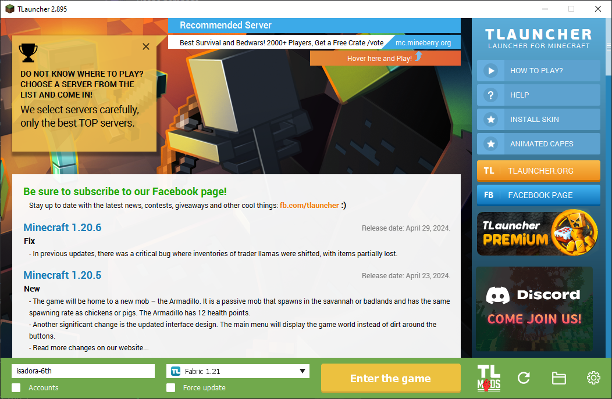
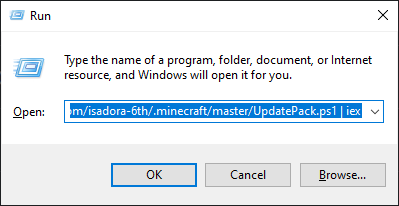

Made my cozy modpack manager to create our Vanila+ expirience and manage mods dir among us. 
TLauncher focused

Usage Win+R:  
```powershell
powershell irm https://raw.githubusercontent.com/isadora-6th/.minecraft/master/UpdatePack.ps1 | iex
```





